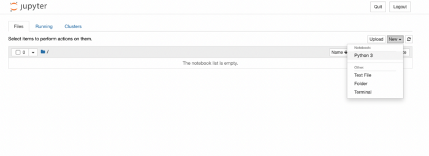

# TensorFlow Training
Used to train Tensorflow models

## Install Tensorflow on M1 Mac

    conda create --name tf-env python=3.8
    conda activate tf-env
    conda install -c apple tensorflow-deps
    pip install tensorflow-macos
    pip install tensorflow-metal
    conda install -c conda-forge -y pandas jupyter

    python -m pip install -r requirements.txt

### Setup Jupyter Notebook
Make a conda environment accesible from Jupyter Notebook, where `tf-env` is your conda environment:

    pip install ipykernel
    python -m ipykernel install --user --name=tf-env

Go to the directory where you have the notebooks:

    jupyter notebook

In Jupyter Notebook select the Tensorflow runtime environment:

### Install OpenVINO

Do this part outside of the conda environment:

[Install OpenVINO M1 Mac](https://medium.com/macoclock/how-to-compile-intel-openvino-to-run-natively-on-apple-m1-7192b5abe6c5)

Confirm that camera is connected:

    cd openvino/bin/intel64/Release
    ./hello_query_device

To use the python scripts:

    conda activate tf-env
    pip install openvino-dev[tensorflow2] FAILS!!

Can't use the python scripts on M1 right now because unable to install rawpy.  See [Python-Image-Converter](https://github.com/achimoraites/Python-Image-Converter/issues/4) issue
  
### Get data from the Raspberry Pi

    scp -r pi@10.0.0.2:~/FRC-OAK-Deployment-Models/DataCollected .

Or login to the Raspberry Pi and zip up the file.  You may need to install zip first:

    sudo apt install zip:
    zip -r data.zip DataCollected

Then to get the data:

    scp pi@10.0.0.2:~/FRC-OAK-Deployment-Models/data.zip .

## References

- [Tensorflow Install M1 Mac](https://caffeinedev.medium.com/how-to-install-tensorflow-on-m1-mac-8e9b91d93706)

- [Tensorflow Metal](https://developer.apple.com/metal/tensorflow-plugin/)

- [A Tool Developer's Guide to TensorFlow Model Files](https://chromium.googlesource.com/external/github.com/tensorflow/tensorflow/+/r0.10/tensorflow/g3doc/how_tos/tool_developers/index.md)  

- [Deep Learning Explainer](https://poloclub.github.io/cnn-explainer/)

myriad_compile -m /tmp/blobconverter/1eec5318dcca43d29ba3ff87bb03189d/road-follow.xml -o /tmp/blobconverter/1eec5318dcca43d29ba3ff87bb03189d/road-follow.blob --data_type=FP16 --mean_values [127.5,127.5,127.5] --scale_values [255,255,255]